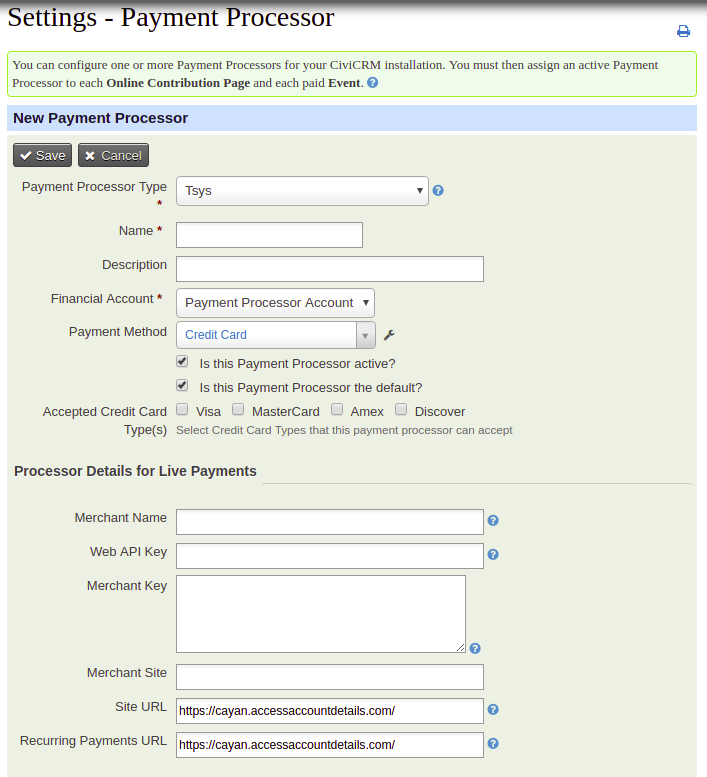

# CiviCRM Tsys Payment Processor

Integrates the [Tsys](https://www.tsys.com/) payment processor (for Credit/Debit cards) into CiviCRM so it can be used it to accept Credit / Debit card payments on your site.

## Documentation
Please see: https://github.com/aghstrategies/com.aghstrategies.tsys

## Configuration
All configuration is in the standard Payment Processors settings area in CiviCRM admin
You will need to enter the following credentials which will be provided on creation of your Tsys Account:

+ Merchant Name
+ Web API Key
+ Merchant Key
+ Merchant Site

See screenshot below.  

## Installation
There are no special installation requirements.
The extension will show up in the extensions browser for automated installation.
Otherwise, download and install as you would for any other CiviCRM extension.

## When Recurring Transactions Fail
The status of the Recurring Contribution should be set to Pending and a message should appear on the System Status page.

## Contribute Transact API
This processor works with the Contribution Transact API but one needs to pass the Currency as USD.

## Testing
[Credit Card Numbers to test with](https://docs.cayan.com/knowledge-base/testing-certification-tools/test-processor)

### To Run phpunit tests:
`$ env CIVICRM_UF=UnitTests user_name='name' password="webApiKey" signature="Key" subject="siteId" phpunit4 ./tests/phpunit/CRM/Tsys/OneTimeContributionTsysTest.php`
